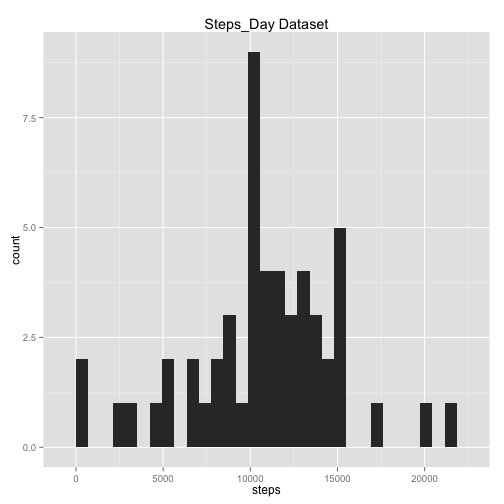
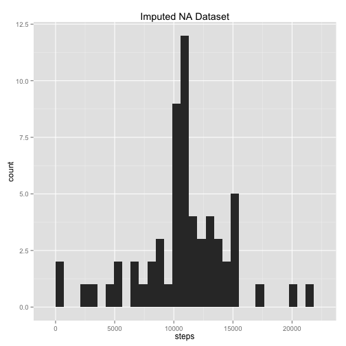
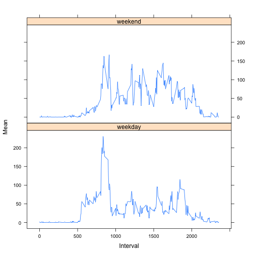

---
output:
  html_document: default
---
# Reproducible Research: Peer Assessment 1


## Loading and preprocessing the data
Load Data located in forked repository


```r
activity <- read.csv("activity.csv")
# Check data and variable types
str(activity)
```

```
## 'data.frame':	17568 obs. of  3 variables:
##  $ steps   : int  NA NA NA NA NA NA NA NA NA NA ...
##  $ date    : Factor w/ 61 levels "2012-10-01","2012-10-02",..: 1 1 1 1 1 1 1 1 1 1 ...
##  $ interval: int  0 5 10 15 20 25 30 35 40 45 ...
```

```r
summary(activity$steps, digits = 5)
```

```
##    Min. 1st Qu.  Median    Mean 3rd Qu.    Max.    NA's 
##     0.0     0.0     0.0    37.4    12.0   806.0    2304
```

Aggregate data for analysis as Steps taken per day and check output


```r
steps_day <- aggregate(steps~date, activity, sum)
steps_day[1:3,]
```

```
##         date steps
## 1 2012-10-02   126
## 2 2012-10-03 11352
## 3 2012-10-04 12116
```

```r
summary(steps_day$steps, digits = 5)
```

```
##    Min. 1st Qu.  Median    Mean 3rd Qu.    Max. 
##      41    8841   10765   10766   13294   21194
```

## What is mean total number of steps taken per day?
Plot histogram of steps per day

```r
library(ggplot2)
ggplot(steps_day, aes(x=steps)) + geom_histogram() + ggtitle("Steps_Day Dataset")
```

```
## stat_bin: binwidth defaulted to range/30. Use 'binwidth = x' to adjust this.
```

 

Find the mean of the total daily steps.


```r
mean(steps_day$steps, na.rm = TRUE)
```

```
## [1] 10766
```

Find the median of the total daily steps


```r
median(steps_day$steps, na.rm = TRUE)
```

```
## [1] 10765
```
These values agree with the Summary statistics of the steps_day aggregate from above.

## What is the average daily activity pattern?

Aggregate data for analysis of steps taken per daily time interval and check output


```r
steps_interval <- aggregate(steps~interval, activity, mean)
head(steps_interval)
```

```
##   interval   steps
## 1        0 1.71698
## 2        5 0.33962
## 3       10 0.13208
## 4       15 0.15094
## 5       20 0.07547
## 6       25 2.09434
```

```r
summary(steps_interval$steps)
```

```
##    Min. 1st Qu.  Median    Mean 3rd Qu.    Max. 
##    0.00    2.49   34.10   37.40   52.80  206.00
```

Plot time series of steps taken per interval over total time frame

```r
plot(steps_interval$steps~steps_interval$interval, type = "l")
```

 

Find the time interval which contains the maximum average number of steps.


```r
maxInterval <- steps_interval[steps_interval$steps == max(steps_interval$steps),]
maxInterval
```

```
##     interval steps
## 104      835 206.2
```
The 5 minute interval with the most steps over the time frame studied 
appears to be at 8:35 in the morning

## Imputing missing values

The Summary statistics of the activity dataset indicates the presence of 2304 NA's.
Impute NA's with mean values for each 5 minute interval.

```r
library(plyr)
# function to replace NA values in activity dataset with mean interval value
impute.mean <- function(x) replace(x, is.na(x), mean(x, na.rm = TRUE))

# use ddply function to create imputed dataset with replacement values for NA
activity.imputed <- ddply(activity[1:3], .(interval), transform, 
                          steps = impute.mean(steps),
                          date = date,
                          interval = interval)

# reorder the dataset
activity.imputed <- activity.imputed[order(activity.imputed$date, activity.imputed$interval),]

# renumber the rows
row.names(activity.imputed) <- 1:nrow(activity.imputed)
```

Create a new daily sum on imputed dataset.

```r
activity.imputed.daily <- aggregate(steps~date, activity.imputed, sum)

# Summarize the new dataset
summary(activity.imputed.daily$steps, digits = 5)
```

```
##    Min. 1st Qu.  Median    Mean 3rd Qu.    Max. 
##      41    9819   10766   10766   12811   21194
```

Plot the new imputed dataset as a histogram


```r
ggplot(activity.imputed.daily, aes(x=steps)) + geom_histogram() +ggtitle("Imputed NA Dataset")
```

```
## stat_bin: binwidth defaulted to range/30. Use 'binwidth = x' to adjust this.
```

 

The histogram shows a slight increase in the number of days with the median 
number of steps per day replacing days with NA's

The mean of the daily imputed dataset is not different from the unaltered dataset
The median value has changed to match the mean, presumably because days which were
orignally NA's have been altered to have the mean value, thus skewing the median.

## Are there differences in activity patterns between weekdays and weekends?

Create a new factor variable in the dataset with two levels – “weekday” and “weekend” indicating whether a given date is a weekday or weekend day.


```r
#Create new column WD and populate with days of the week.
activity.imputed$WD <- weekdays(as.Date(activity.imputed$date))
#Convert days of the week to weekend or weekday
activity.imputed$WD <- ifelse(activity.imputed$WD %in% c("Saturday", "Sunday"),
                              "weekend", "weekday")
```

Aggregate the imputed data on the daily interval and weekend/weekday variables


```r
#Aggregate imputed dataset steps on daily interval broken into weekday v. weekend
newsteps.agg <- aggregate(steps~interval + WD, activity.imputed, mean)
str(newsteps.agg)
```

```
## 'data.frame':	576 obs. of  3 variables:
##  $ interval: int  0 5 10 15 20 25 30 35 40 45 ...
##  $ WD      : chr  "weekday" "weekday" "weekday" "weekday" ...
##  $ steps   : num  2.251 0.445 0.173 0.198 0.099 ...
```

Create a time series panel plot comparing steps taken per interval on weekends 
versus weekdays.


```r
library(lattice)
xyplot(newsteps.agg$steps ~ newsteps.agg$interval|newsteps.agg$WD,type="l",ylab="Mean", xlab="Interval",layout=c(1,2))
```

 

Summary comparisons:

```r
#Weekday steps summary
summary(newsteps.agg[newsteps.agg$WD == "weekday",3 ])
```

```
##    Min. 1st Qu.  Median    Mean 3rd Qu.    Max. 
##    0.00    2.25   25.80   35.60   50.90  230.00
```

```r
#Weekend steps summary
summary(newsteps.agg[newsteps.agg$WD == "weekend",3 ])
```

```
##    Min. 1st Qu.  Median    Mean 3rd Qu.    Max. 
##    0.00    1.24   32.30   42.40   74.70  167.00
```

* Weekend mean and median number of steps per daily interval are greater compared 
to the same statistics during weekdays. 
* Maximum steps per interval are 37% greater during weekdays.
* Weekend steps per interval start later and seem to end later as compared to the
weekdays. 

